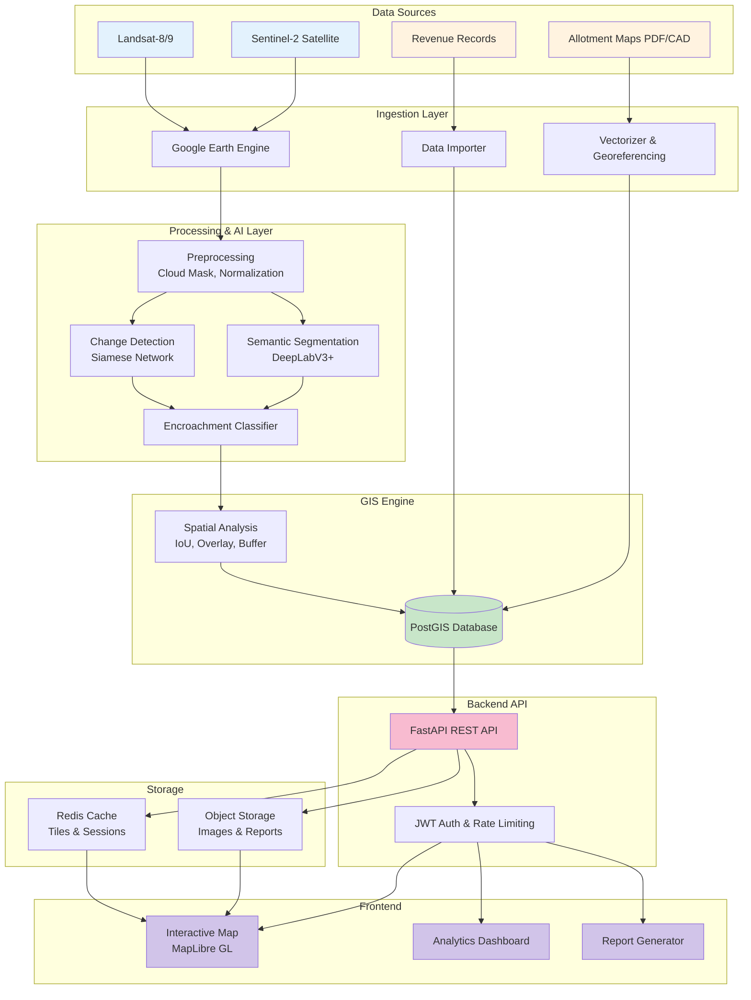

# ILMCS System Architecture Diagram

## System Layers

### 1. **Data Sources**
- Satellite imagery (Sentinel-2, Landsat)
- Allotment maps and administrative records

### 2. **Ingestion & Processing**
- Google Earth Engine for satellite data
- AI/ML models for segmentation and change detection
- GIS engine for spatial analysis

### 3. **API & Storage**
- FastAPI backend with JWT authentication
- PostGIS for spatial database
- Redis & Object Storage for caching

### 4. **Frontend Applications**
- Interactive maps with violation overlays
- Analytics dashboards
- PDF report generation
