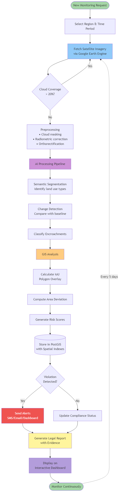
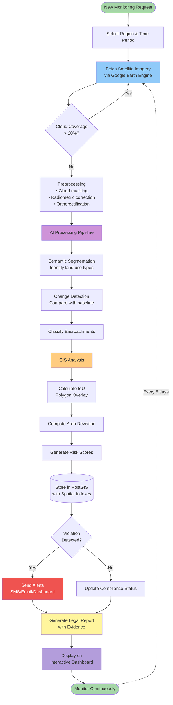

# ILMCS System Workflow Diagram

## Interactive Mermaid Diagram

## Workflow Steps

### Phase 1: Data Acquisition
1. User selects region and time period
2. System fetches satellite imagery from Google Earth Engine
3. Validates cloud coverage before processing

### Phase 2: AI Processing
4. Preprocessing: cloud masking, normalization
5. Semantic segmentation to identify land features
6. Change detection comparing with baseline
7. Classification of potential encroachments

### Phase 3: GIS Analysis
8. Calculate Intersection over Union (IoU)
9. Compute area deviations from allotted plots
10. Generate risk scores based on violations

### Phase 4: Action & Reporting
11. Store results in PostGIS with spatial indexing
12. Trigger alerts for detected violations
13. Generate legal reports with satellite evidence
14. Display on interactive dashboard

### Continuous Monitoring
- System automatically re-runs every 5 days (Sentinel-2 revisit)
- Maintains historical baseline for trend analysis
